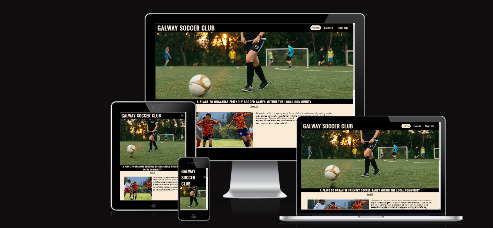
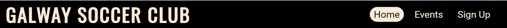
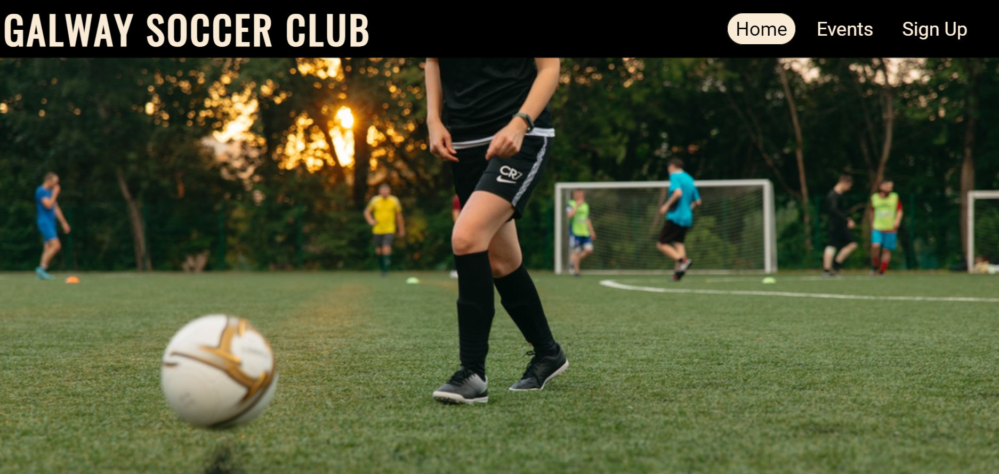
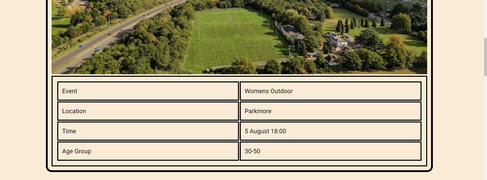
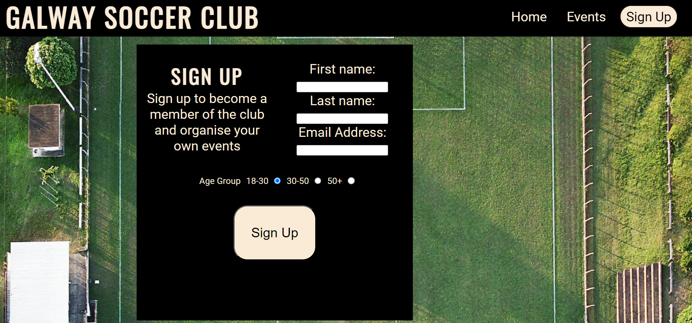

# Galway Soccer Club

[Galway Soccer Club](https://richieon88.github.io/galway-soccer-club/) is a website for people looking for a place to organise and participate in friendly games of soccer in the Galway area. The aim of the website is to draw in more people to join the club and become members. It also acts as a place where people can highlight and advertise the events that they organised and the time and the locations that they are taking place in.

## Technologies used

- HTML
- CSS
- Font Awesome icons
- Google fonts

## Features

In this section, you should go over the different parts of your project, and describe each in a sentence or so. You will need to explain what value each of the features provides for the user, focusing on who this website is for, what it is that they want to achieve and how your project is the best way to help them achieve these things.

### Existing Features

- **Navigation Bar**

  - The navigation bar is featured across all the pages of the website. It features a logo, home, events and sign up sctions all located in the header.
  - This section is fully responsive and the home, events and sign up elements change to a dropdown menu on smaller screens.
  - These elements allow the user to navigate the website easily without having to resort to using the back button on the browser.

- **The landing page image**

  - The landing includes a main image conveying what the main subject of the site is.
  - Under the main image is a description that details what exactly the website is about.

- **Main Section**

  - The main section on the home page features three scetions that go into more detail explaining what Galway Soccer Club is and the service it offers.
  - The three sections are about us, explaining the club to users, why join us, explaining the benifits of becoming a member, and where we play, telling users the locations that the club uses.

- **The Footer**

  - The footer section includes has links to the three social media platforms that the club uses.
  - The footer provides an easy way for users to visit the clubs social media accounts.

- **Events Page**

  - The events section is a page to display the upcoming eents organised by members of the club.
  - This section features an image and a table with times, locations and the type of events that have been set-up.
  - This page shows the user the type of events the club has planned.

- **The Sign Up Page**

  - This page contains a form which provides the user with a way to become a member of the club.
    It has a first name, last name and email address boxes for the user to fill out.
    It also has radio buttons for users to enter their age-group so they can play with people in their own age-group.

### Features Left to Implement

- A gallery feature could be implemented to show users images of people taking part in events to showcase what to expect from the club.
- Links on words in the main section that lead to the other pages could also be implemented.

## Testing

- I tested that the website works in different browsers: Chrome, Firefox,Edge.
- I tested on different size screens to make sure it was responsive and everthing functions as intended.
- I tested all the links to make sure they all work and lead to the correct locations.
- I tested the form works and requires you to fill it before submiting.

### Validator Testing

- ##### HTML

  - No errors or warnings were found when passing through the official W3C validator.

- ##### CSS

  - No errors or warnings were found when passing through the official W3C (Jigsaw) validator.

- ##### Accessibility and performance

  - Using lighthouse in devtools I confirmed that the website is performing well, accessible and colors and fonts chosen are readable.
    

### Bugs

- ##### Solved bugs

  - There was a bug in the navigation menu where the sign up link was not displaying properly at certain screen sizes.
  - I fixed it by adjusting the width of the navigation menu for certain screen sizes.

  ***

  - I had a bug on the form page when changing its size. The elements inside the form displayed in an unexpected way.
  - I fixed it by adjusting the display type and adjusting heights and widths of the form elements.

- ##### Unsolved bugs

  - None.

## Deployment

- The site was deployed to GitHub pages. The steps to deploy are as follows:
  - In the GitHub repository, navigate to the Settings tab
  - From the source section drop-down menu, select the Master Branch
  - Once the master branch has been selected, the page will be automatically refreshed with a detailed ribbon display to indicate the successful deployment.

The live link can be found here - [Galway Soccer Club](https://richieon88.github.io/galway-soccer-club/)

## Credits

### Content

- Elements of the navigation bar are taken from the Love Running project.
- I used tutorials by [Kevin Powell](https://www.youtube.com/@KevinPowell) to help me use flex on the wbsite
- The icons in the footer were taken from [Font Awesome](https://fontawesome.com/)

### Media

- All the images used on the site were taken from the website [Pexels](https://www.pexels.com/)
